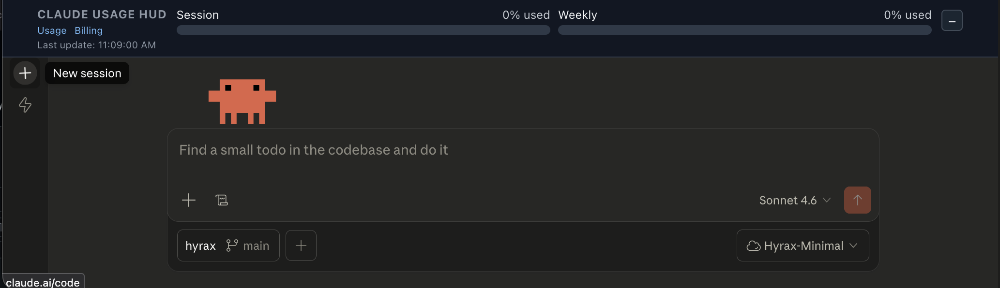
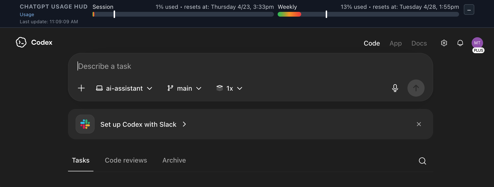

# Firefox Usage HUD Extension (ChatGPT + Claude)

Tiny personal Firefox extension that adds a top-page banner HUD on:

- `https://chatgpt.com/*`
- `https://claude.ai/*`

The HUD shows:

- **Session usage** bar
- **Weekly usage** bar
- A tiny debug line with last update time

Both bars render from **0% → 100% used** (inverted from APIs that report remaining quota).

If usage can't be fetched yet:

- Shows **`not logged in`** for auth failures (`401` / `403`)
- Shows **`error`** for other failures

For debugging, open Web Console and filter for `"[usage-hud]"` log lines.

## Load in Firefox (Temporary Add-on)

1. Open Firefox.
2. Go to `about:debugging`.
3. Click **This Firefox**.
4. Click **Load Temporary Add-on...**.
5. Select `manifest.json` from this folder.
6. Open `chatgpt.com` or `claude.ai` in a tab.

## Files

- `manifest.json` – Firefox extension manifest
- `content.js` – content script that injects HUD and fetches usage
- `styles.css` – HUD styles

## Notes on API behavior

- ChatGPT uses `/backend-api/wham/usage`
- Claude uses `/api/organizations/<lastActiveOrg>/usage` (org ID sourced from `lastActiveOrg` cookie/localStorage)
- ChatGPT parsing is explicit: `rate_limit.primary_window.used_percent` for Session and `rate_limit.secondary_window.used_percent` for Weekly
- Claude parsing is explicit: `five_hour.utilization` for Session and `seven_day.utilization` for Weekly
- Claude details include reset times from `five_hour.resets_at` / `seven_day.resets_at`, formatted in the browser's local timezone as `Weekday M/D h:mmam/pm` (example: `Tuesday 4/21 3:58pm`)
- ChatGPT details include reset times from `rate_limit.primary_window.reset_at` / `rate_limit.secondary_window.reset_at` (epoch seconds), formatted the same way
- ChatGPT requests are sent from the content script with the last observed working auth/header set captured by the background `webRequest` listener from `https://chatgpt.com/backend-api/*` traffic (Authorization + OAI headers)
- Background instrumentation still forwards sanitized snapshots to content logs (`[usage-hud] sniff-wham-headers`) with only an Authorization preview (not full token)
- If header snapshots don't appear in page console, check extension background console for `[usage-hud-bg]` startup and request logs

If provider internals change, you'll still get a visible HUD with `error`, and can update endpoint/parsing logic in `content.js`.

## Debug behavior in this version

- Poll interval is `30s`.
- Claude requests append a `_hudts=<timestamp>` query param so repeated polls are visible.
- Requests are forced to absolute same-origin URLs (for example `https://claude.ai/api/usage?...`) so content-script fetches don't accidentally resolve against the extension origin.
- ChatGPT requests intentionally avoid the `_hudts` cache-buster to match known-good request shape.
- Non-2xx responses now log a short body snippet to help quickly identify wrong endpoints.
